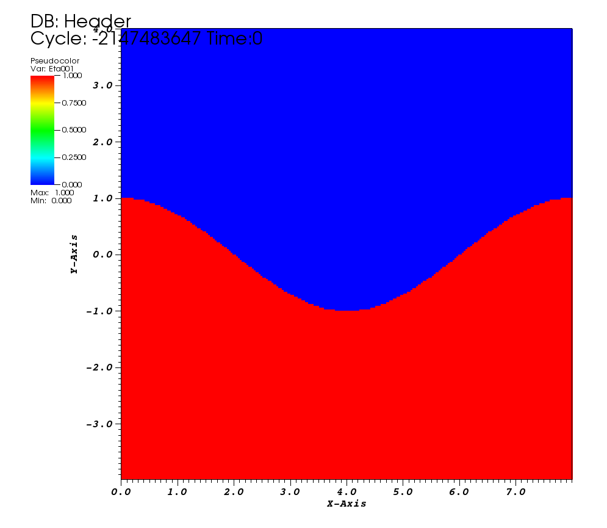

Peturbed Interface
------------------
Peturbed Interface intializes a boundary within the mesh, with different field values on either side.
The initial boundary is the x = z = 0 plane, and is perturbed using a user defined function.

.. doxygenclass:: IC::Peturbed
   :project: alamo
   :members:
   :protected-members:
   :private-members: