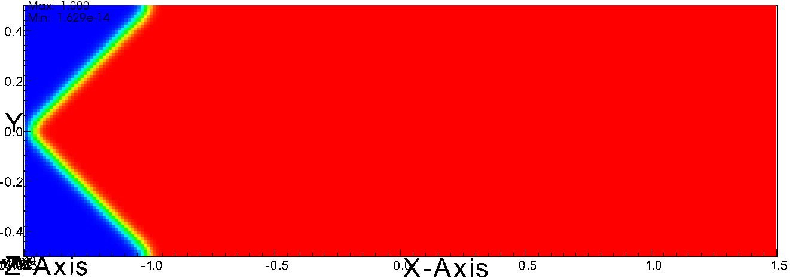

Wedge
-----
IC used with the flame test, initializes a wedge shaped burn front on one end of the coupon.

.. doxygenclass:: IC::Wedge
   :project: alamo
   :members:
   :protected-members:
   :private-members: