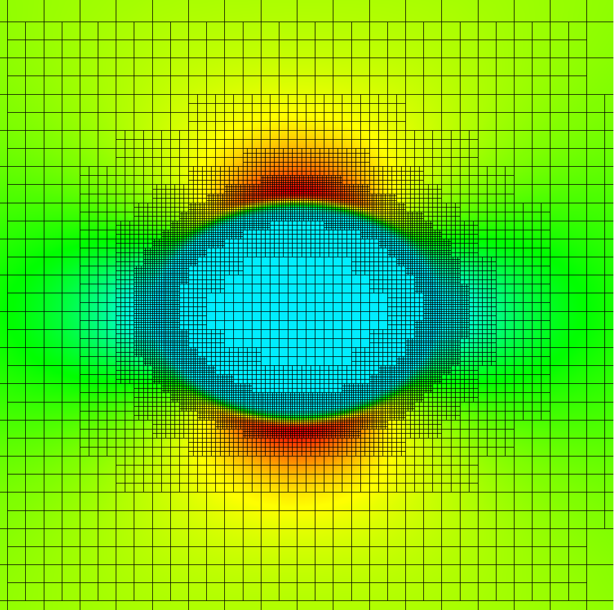

.. role:: cpp(code)
   :language: c++
.. role:: bash(code)
   :language: bash

Eshelby Inclusion
======================

   Hello there

.. literalinclude:: ../../../tests/Eshelby/input
   :caption: Eshelby input file (tests/Eshelby/input)
   :language: makefile
