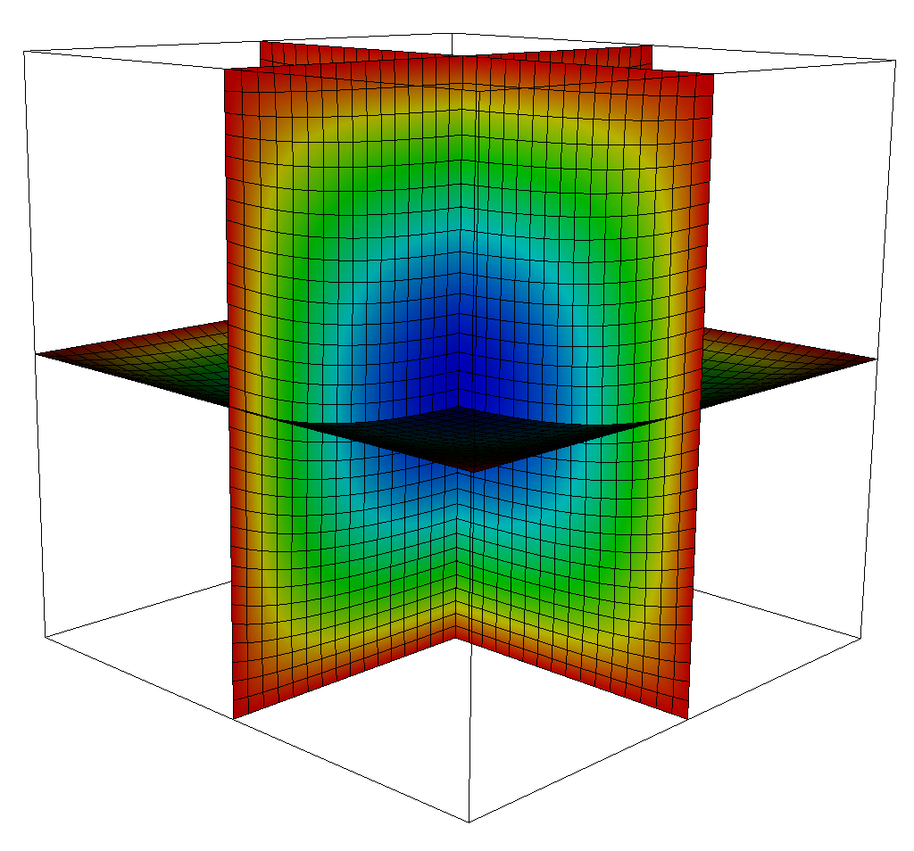

.. role:: cpp(code)
   :language: c++
.. role:: bash(code)
   :language: bash

Finite Kinematics with Neo-Hookean Material
===========================================

This solves a nonlinear elasticity problem using a Neo-Hookean material mode.
Note that it uses simple boundary conditions (Dirichlet) - complex BCs are still in progress.
Also note that it works in 3D ONLY - Neo-Hookean has not been implemented for 2D.

.. literalinclude:: ../../../tests/FK/input
   :caption: Finite Kinematics input file (tests/FK/input)
   :language: makefile
