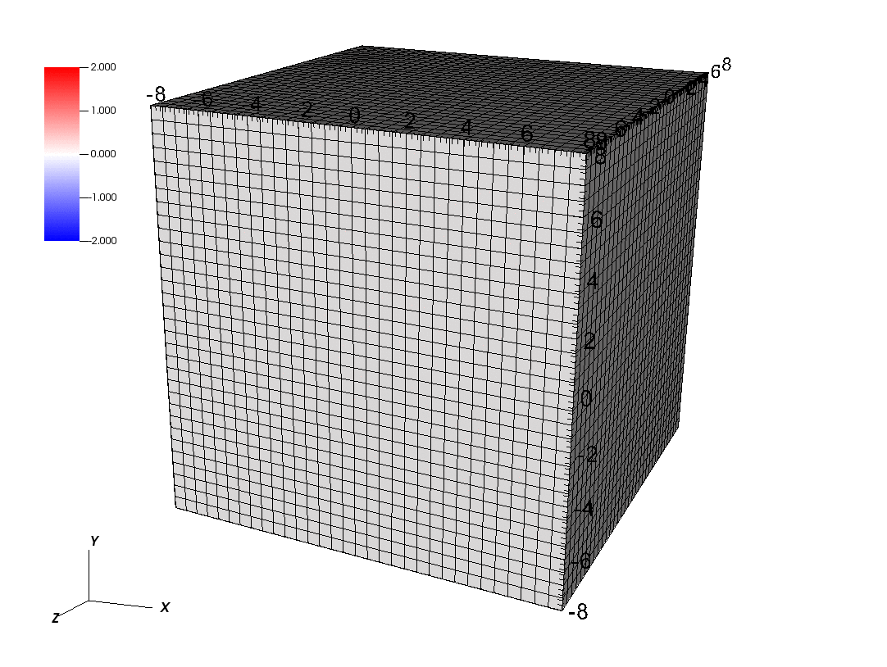

.. role:: cpp(code)
   :language: c++
.. role:: bash(code)
   :language: bash

Finite Kinematics
=================

This solves a nonlinear elasticity problem using a Neo-Hookean material model.
The material is subjected to uniaxial tension, first -50% strain and then +50% strain.
The loading profile is specified using the interpolator constructs for :code:`elastic.bc.val.xhi...`.

This currently works in 3D ONLY - Neo-Hookean has not yet been implemented for 2D.

.. literalinclude:: ../../../tests/FK/input
   :caption: Finite Kinematics input file (tests/FK/input)
   :language: makefile
