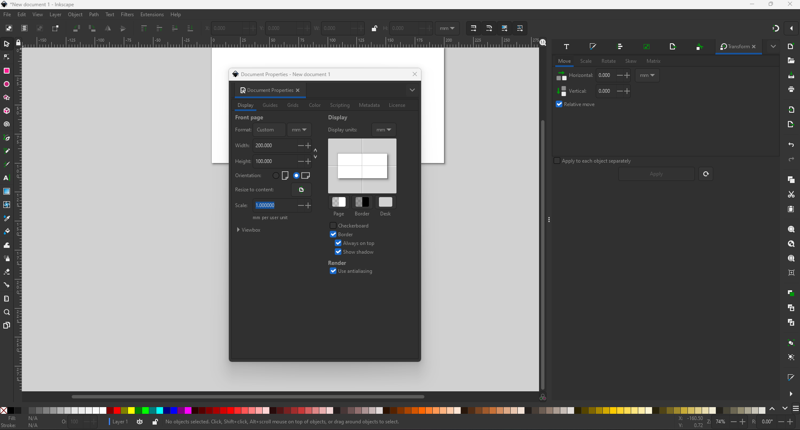
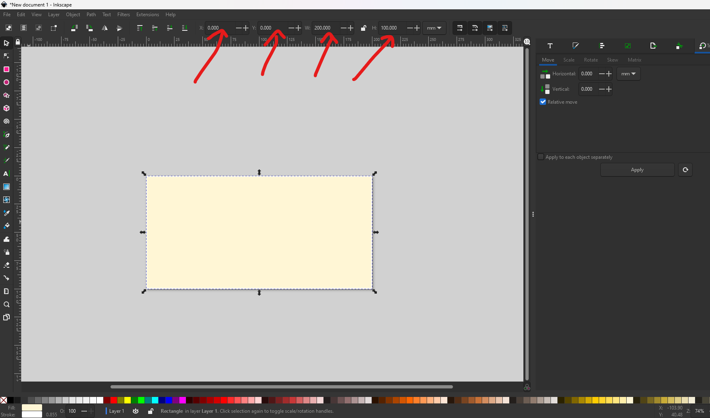
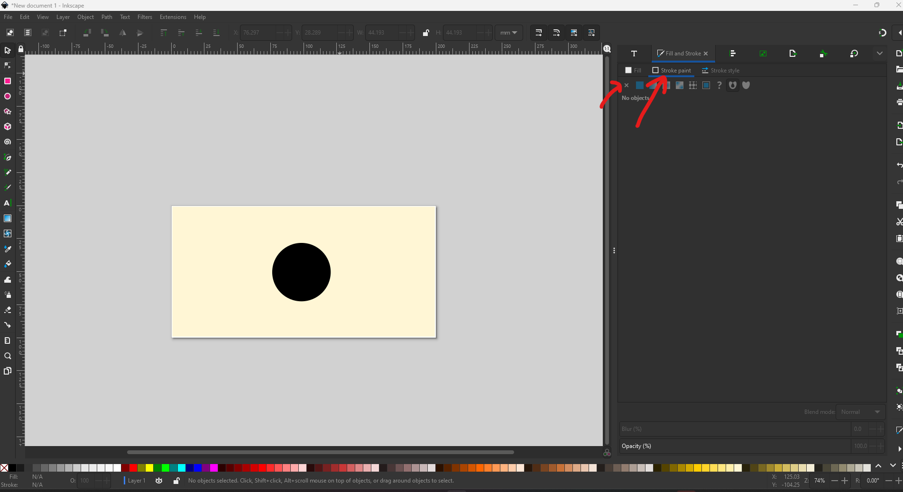
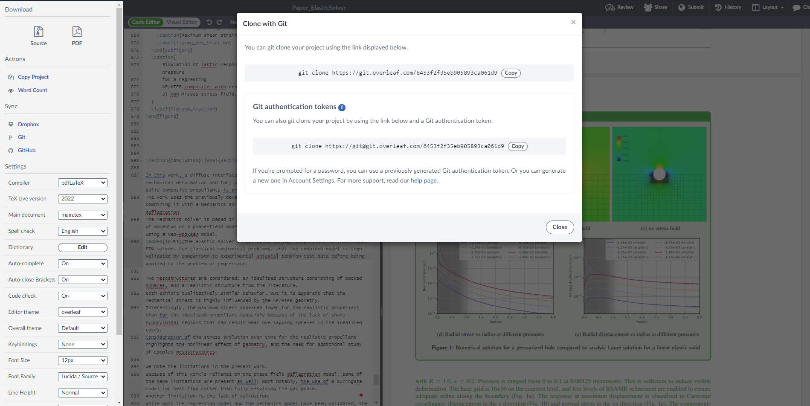
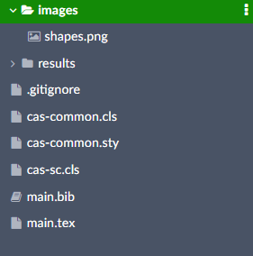
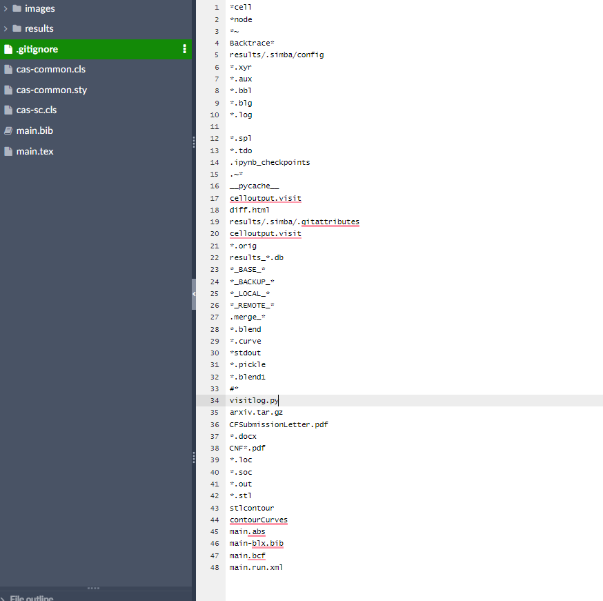

.. role:: cpp(code)
    :language: c++

.. _studentguides:

=========================================
:fas:`code;fa-fw` New Student Guide
=========================================

:fas:`rocket;fa-fw` Introduction
====================================================

This is a comprehensive guide to get new members of the Solids Group up to speed with all the tools we use. It is written 
under the assumption that the new student does not have prior knowledge of C++, Python, and Linux. 
Thus, it provides with details on very basic usages. For more advanced students, this file may still be useful 
for quick reference of commands that are not frequently used. 
All terminal commands provided here assume that you are running a Debian-based version of Linux. 
Exact commands may vary depending on the Linux distribution, but you should be able to google it. 
In addition, all commands are highlighted in blue.

:fas:`rocket;fa-fw` Alamo
====================================================

#. Install
    If you are new to Linux and git usage, start by making sure your computer has git installed. 
    Open a terminal and type the following command:
    
    .. code-block:: bash

        sudo apt install git; sudo apt update; sudo apt upgrade

    In addition, you may want to download and run the New Computer script from the Solids Group page, which can be done by 
    using the following command on a terminal:
    :code:`wget https://drive.google.com/file/d/1nJD3Ts8dVNCQsBHgyvVEHIyUtuXlsRsk/view; sudo bash new-computer-configure.sh`
    This file can also be accessed by going to :code:`https://solids.group -> Resources -> New computer configure script`
    
    If you are an Alamo collaborator and have set up ssh keys to your GitHub account:
    Open a terminal and type

    .. code-block:: bash

        git clone git@github.com:solidsgroup/alamo.git

    If you do not have those privileges:
    Open a terminal and type

    .. code-block:: bash

        git clone https://github.com/solidsgroup/alamo.git

#. Configure and Make
    Alamo has a variety of installation options. By default, it is installed in 3D mode and in production mode (i.g. not in debug mode). 
    Different settings are accessed by adding flags to the configure file before using make. 
    The following is an example of how to configure Alamo to 2D mode, debug mode, and to send a request to install the Eigen 
    library, which is used by some Alamo functions.

    Navigate to the Alamo folder, assuming you cloned Alamo to your home directory and with :code:`<username>` being your 
    computer name, open a terminal and type:                         
    
    .. code-block:: bash

        cd /home/<username>/alamo or cd ~/alamo

    Type: 
    
    .. code-block:: cpp

        ./configure –dim 2 –debug –get-eigen 

    While the example shows the use of debug, I recommend leaving that off unless you are trying to debug an error, 
    as this flag will cause Alamo to run slower.	 

    Once you are finished configuring Alamo, you need to “Make Alamo” in order to create the binary files and actually be 
    able to run the software. That can be done simply by typing make on the terminal inside the Alamo directory. 
    Note that this process can take a few minutes, and can be accelerated by using parallel processing using the j flag. 
    For example, :code:`make -j8` which will run using 8 processors. To know how many processors you can use, check the number of 
    cores available in your machine in the settings, type lscpu on your terminal to get that information. 
    Make sure to always leave at least 2 free cores when running any parallel Alamo computation.

#. Test
    Now that you have successfully installed Alamo, you can proceed to run a test case. There is a variety of working 
    cases for different problems inside :code:`~/alamo/tests`. To run one of the tests cases, navigate to the alamo 
    directory (:code:`cd ~/alamo`) and type the following command: 
    
    .. code-block:: cpp

        mpirun -np 2 ./bin/alamo-2d-g++ ./tests/Eshelby/input
        
    In this example, the flag -np is used to indicate the number of processors to be used for parallel computing (2 in this case). 
    Also, note that the g++ alamo file has 2d in its name. If you did not configure using the flag :code:`–dim 2`, that file name 
    will have 3d instead. If you configure using the debug flag, the file name will be :code:`alamo-2d-debug-g++`. To check the name 
    simply navigate to :code:`~/alamo/bin/` and type ls.
    The input file in eshelby will generate an output folder in :code:`~/alamo/tests/Eshelby/` and the results can then be 
    visualized using VisIt.

#. New Integrator Development

    #. Create it
        Integrators are the basic workhorse in Alamo.
        They are called Integrators because they usually (although not always) are intended to integrate a PDE in time.
        In this tutorial, we will create a new integrator based on the existing HeatConduction integrator.

        Create a copy of :code:`./src/Integrator/HeatConduction.H` inside the same directory, called `MyPDE.H`
        (We will use the working name "MyPDE" here - you can replace with your own name.)

        Rename all instances of HeatConduction with MyPDE inside :code:`./src/Integrator/MyPDE.H`.
        This includes the names throughout the code as well as the `include guard <https://en.wikipedia.org/wiki/Include_guard>`__
        in the first two lines.

        Include the file in :code:`./src/alamo.cc`

        .. code-block:: cpp

            #include "Integrator/MyPDE.H"

        and add a caller inside the main function:

        .. code-block:: cpp

            //existing
            else if (program == "thermoelastic")integrator = new Integrator::ThermoElastic(pp);
            //new
            else if (program == "mypde")        integrator = new Integrator::MyPDE(pp);
        
        Finally copy the Heat Conduction example file to the root directory

        .. code-block:: bash

            cp ./tests/HeatConduction/input ./input
        
        In the input file change the :code:`plot_file` to `output` and :code:`alamo.program` to :code:`mypde`.

        You should now be able to compile and run the code.
        The result will be the same as for the heat conduction example, but will be based on the newly copied integrator.

        You can now begin alternating the code to achieve different outputs.
        The HeatConduction integrator has extensive, line-by-line documentation.

    #. Implementation
        Alamo integrators inherits from Integrator.cpp, which handles the time evolution leaving with 6 functions that can be overriten:
        
        - ParmParse
            This function is responsible for reading an input file and registering fields. Variables can be read using the :code:`pp_query_default`, :code:`pp_query_required` and 
            :code:`pp_query_validade`. Every field variable that in declared in the header file needs to be registered. This allows you to controlt
            the field's properties, by selecting the number of dimensions the field has, the type of boundary and initial conditions, number of ghost cells, 
            field component subnaming and weather or not the field is ploted out.

        - Initialize
            Use this function to set the initial conditions of all fields. If the field does not have initial conditions set it to 0 or 1 to 
            avoid memory junk to enter the integrator.
            This function is called before any time and space loops start and can be use to compute properties that depend on inputs.
        
        - TimeStepBegin
            This function is called at the beginning of every timestep. This function can be used
            to complete additional global solves, e.g. a MLMG implicit solve.
            Overriding is optional; the default is to do nothing.
        
        - TimeStepCompleate
            This function is called at the end of every timestep. This function can be used
            to complete additional global solves, e.g. a MLMG implicit solve.
            Overriding is optional; the default is to do nothing.
        
        - Advance  
            This function is where most of your model implementation should reside. Note that you should not use traditional for loops 
            in this function, as this would remove alamos hability to parallel process efficiently. However, this function will need one for loop for the 
            regring levels. The following is a generic form of the this function, assuming there is a field called :code:`phi_mf`:
            
            .. code-block:: cpp
                
                const Set::Scalar* DX = geom[lev].CellSize();
                for (amrex::MFIter mfi(*phi_mf[lev], true); mfi.isValid(); ++mfi)
                {
                    const amrex::Box& bx = mfi.tilebox();
                    amrex::Array4<Set::Scalar> const& phi = (*phi_mf[lev]).array(mfi);
                    amrex::ParallelFor(bx, [=] AMREX_GPU_DEVICE(int i, int j, int k)
                    {
                        // Your Code Here, i.e:
                        phi(i,j,k,0) += 1.0 / DX[0];
                    });
                }
    
            In this example DX is a vector that hold the grid size in each direction. Other box options are avaliable, and both node and cell 
            based computations can be performed.

        - TagCellsForRefinement 
            This function is used to select which cells in the domain need to be refined. There are several methods to define regriding regions
            and it can be selected as it best suits your model and implemented here. A traditional way of doing this that is used in most integrators 
            within alamo is to compute the gradient of the fields and tag it if it is within a threshold. 
        
        - Regrid
            This function effectively regrids the regions that are tagged. The frequency with which the regriding happens can be altered
            through the input variable :code:`amr.base_regrid_int = 1`.

#. Input File
    Alamo is a large code and there is a large amount of inputs that can be provided to perform the desired simulations. 
    Before we talk about how to write an input file, let’s briefly review how Alamo handles this input file. 

    First, you need to know which integrator you will be using. Navigate to :code:`~/alamo/src/Integrator` to check 
    out the list of integrators that are already been implemented. Most integrators are composed of a .H file and a .cpp 
    file. If you are not familiar with C++, .H files will generally set the scope of variables used in the integrator, 
    without performing any calculations, by simply declaring variables and fields, their data type, and optionally a value. 
    Additionally, the functions that will be used are also declared in the .H, without defining what they do just yet. 
    The following image shows examples of content found inside .H files. 

    .. image:: studentguide/alamo_1.png
        :width: 600px
        :align: center

    Once these variables are declared, their values can be modified by performing code assignments inside .cpp files, or 
    by parsing values from an input value. To know:
    Parsing functions that read from the input file are going to appear in many different files, there is no one parsing .cpp 
    file for all variables. 
    It is generally good practice to include a parser for all variables that are not directly computed in the code so 
    that the number of times you'll need to recompile the code decreases. 
    If alamo tries to parse a variable that does not show in the input file, it will skip that line. So it is hardly 
    the case you have too many parsing lines. 
    The following image is an example of how to parse a variable from the input file:

    .. image:: studentguide/alamo_2.png
        :width: 600px
        :align: center

    Note that the text in quotes “thermal.on” is the variable name in the input file, while the text after value. 
    Is the name of the variable in the .H file. They do not have to be the same, although they will normally be.

    If you are starting a new integrator, be aware of the following:
    For alamo to identify new integrators, they have to be added to the :code:`~/alamo/src/alamo.cc` file.
    New integrators will generally inherit from Integrator.H, and thus they should stick to the predefined set of 
    functions inside that class.

    Now, the writing of an input file consists of a .txt file, where each line is one variable separated by the = sign. To know:
    # can be used to commend out a line
    Do not use any type of line breaker (such as ; in C++)
    Numbers can be parsed in scientific notation (i.e. 1.0e5) 
    You don’t need to discriminate between string and numbers.
    If a variable type is int, make sure not to add floating points (i.e. 1.0)

    Some common variables in most alamo input files:
        - alamo.program = name of the integrator in alamo.cc 
        - plot_file = relative path to output files
        - timestep 
        - stop_time 
        - amr.plot_int = frequency alamo writes to output
        - amr.plot_dt = frequency alamo writes to output
        - amr. n_cell = number of cells in the most coarse level
        - amr.max_level = number of refinement levels
        - geometry.prob_lo =  x y z lower values for the base box
        - geometry.prob_hi =  x y z upper values for the base box

    Note that a full list of variables that can be parsed can be found in alamo documentation (https://alamo.readthedocs.io/en/latest/index.html) and that the input search tool in the documentation is very useful (https://alamo.readthedocs.io/en/latest/InputsSearch.html). The following is an example of a fully working input file content:

    .. image:: studentguide/alamo_3.png
        :width: 600px
        :align: center

#. Code Debug
    Alamo is a large code with thousands of lines, and debugging errors can be a very challenging task. 
    Here are some initial ideas of how to first approach the debugging process. 

    Debug mode: when the code breaks before reaching stop_time, backtrace files are automatically generated from alamo, 
    in the directory the processes were run from. You’ll notice that in production mode, the backtrace files are useless,
    and do not provide any information about what/where the problem is. If you reconfigure Alamo and compile in debug mode, 
    running the code again with a single core, will generate a single backtrace file that has similar information to Python 
    sigaborts backtrace. Read the file from bottom to top, it will often point you to what code line in your code is called to 
    abort the process. 
    Alamo has an integrated utility tool that can be used to plot out values, abort processes, and get other information 
    while running your code. The following is a sample  of code lines to check for errors during the run and output useful information:

    .. image:: studentguide/alamo_4.png
        :width: 600px
        :align: center

    The util tool also has a parallel version of Message and Abort. 

#. Compiling errors

    Because Alamo is built using several libraries, there will often be errors when compiling it for the first time. 
    These errors may change over time based on upgrades in different libraries and of Alamo itself, making it hard 
    to construct a list of debug approaches. However, here is a list of the first steps in debugging first-time compiling errors:
    Alamo only works in Linux systems (It does work in WSL); MacOS will attempt to build Alamo but will fail due to missing requirements.
    Navigate to ~/alamo/docs/requirements.txt and make sure those libraries are installed. 
    Linux generally carries openmpi by default, but Alamo requires the use of MPich instead. 
    Make sure to install this library. If using an HPC, make sure to load the mpich module. (on incline you simply need to 
    type :code:`module load mpich`; If it fails due to openmpi being loaded, follow the instruction on screen to swap openmpi with mpich.
    Install libpng using: sudo apt install libpng-dev

:fas:`rocket;fa-fw` Visit
====================================================

#. Install 
    Visit documentation page has an installation guide here (https://visit-sphinx-github-user-manual.readthedocs.io/en/v3.4.0/getting_started/Installing_VisIt.html). I’ll add here a quick walkthrough, for the current stable version of visit. Be aware that his version may be outdated by the time you read this document. 

    On a new terminal:

    .. code-block:: bash
        
        wget https://github.com/visit-dav/visit/releases/download/v3.3.3/visit-install3_3_3 ; 
        wget https://github.com/visit-dav/visit/releases/download/v3.3.3/visit3_3_3.linux-x86_64-ubuntu20.tar.gz ; 
        chmod +x visit-install3_3_3 ; 
        ./visit-install3_3_3 3.3.3 linux-x86+64-ubuntu20 /opt/visit ;

    When prompted, select option 0.
    Once the installation is complete, you can either create an alias or export the PATH in the :file:`~/.bashrc` file.
    Example: 

    .. code-block:: bash

        alias visit=”/opt/visit/bin/visit” 
    
    Or 

    .. code-block:: bash

        export PATH=${PATH}:/opt/visit/visit3_3_3.linux-x86_64/bin/

#. Basic Plots
    Once you completed the installation process, you can run visit by typing visit to a terminal (remember to start a new terminal after updating .bashrc so the changes take effect). 
    Alamo will generate either :code:`celloutput.visit` or :code:`nodeoutput.visit` (or both) inside the output folder, which can then be read into visit. 

    .. image:: studentguide/visit_1.png
        :width: 600px
        :align: center

    You can then add plots using the Add button. There are several ways to plot data in visit, but we will normally use the Pseudocolor option for most plots. 

    .. image:: studentguide/visit_2.png
        :width: 600px
        :align: center

#. Contour
    You will notice that if you plot 2 variables at the same time using Pseudocolors, only the last of them will be displayed. Depending on the type of data you are trying to visualize, it may be convenient to add a contour plot, since this plot will show on top of the pseudocolor plot allowing for more data to be visualized at once.

#. Isovolume 
    Isovolume is a visit operator that allows you to cut off parts of the domain as you want. It is also an alternative way to visualize the data of two fields simultaneously. An example of this is when using the flame integrator, you may not be interested in the region where eta = 0 (fluid zone), and thus you can display only the “solid” region by using the isovolume to cut off eta < 0.1 while displaying the temperature profile. 

    .. image:: studentguide/visit_3.png
        :width: 600px
        :align: center

#. Annotations
    Youll notice that Visit plots out a lot of annotation information that can get the screen a bit polluted. While that is not a problem for general data visualization, you may want to clean it up when creating images for papers and presentations. You can use the annotation control panel to fully customize the information that is shown, and also to move, resize, and rename the legend information. 

    .. image:: studentguide/visit_4.png
        :width: 600px
        :align: center

#. Saving Content
    You can access the window saving setting by pressing ctrl+shift+o (or going to :code:`file -> set save options` … ). This function allows you to save the current displayed window in different formats.
    You can also save .curve files, which are text files that contain the values of certain curves you may be displaying. This can be useful, for example, to get to the location of an interface in each time step, and then process this data on Python to generate other plots. 

    You can also generate movies for the time evolution of the system. There are different ways of doing that, but I recommend saving png shots and then using gifski and ffmpeg to create gifs and movies. 

    To do so, go to :code:`file -> save movie`, and select the png image format.

    .. image:: studentguide/visit_5.png
        :width: 600px
        :align: center

    Now you can create a gif by going to the directory you saved the png images and using the following terminal command: 

    .. code-block:: bash

        gifski -o <gifname>.gif visit*.png

    If you don't have gifski installed, you can install it by using snap install .

#. Python Scripting
    Visit has a prompt command (CLI) that allows you to execute Python scripts to perform different actions. This can be useful, for example, when you want to extract some information from a simulation plot that has a lot of samples. You may be testing different combinations of parameters that require you to run Alamo hundreds of times, and then you have to analyze the impact on the result, and doing so for each case would be extremely time-consuming. 

    The first step for writing a Python script is to open visit and record your actions inside while adding plots, and doing any other actions that you want to script for. To do so, go to :code:`controls -> commands` and click record.

    .. image:: studentguide/visit_6.png
        :width: 600px
        :align: center

    Then, proceed to do the actions you would like to automate (adding plots, operators, changing colors, annotations, etc). When you are done, click stop in the command box and visit will create a list of commands. 

    .. image:: studentguide/visit_7.png
        :width: 600px
        :align: center

    You can now copy those commands to a Python file. Here is a sample of python script:
    PS: remember to import visit 

    .. image:: studentguide/visit_8.png
        :width: 600px
        :align: center

    .. image:: studentguide/visit_9.png
        :width: 600px
        :align: center

    Now, you can execute the following command:

    .. code-block:: cpp

        visit -cli -nw -s pythonfile.py 

    The -nw flag is optional, and stops visit from trying to launch a new window. This flag is only necessary if you are running visit inside of a machine that can not launch user interfaces, such as an HCP (incline). 

:fas:`rocket;fa-fw` Simba
====================================================

Often when running Alamo, you will run large numbers of simulations which will create several output data folders. 
This will quickly make it difficult to manage and remember the difference between different simulations and 
whether they are relevant or not.
Simba is a utility tool that helps you organize this directory using SQL. 
After installing and configuring, you will be able to launch a webpage that lists all 
the simulations and their metadata information. It also allows you to delete bad/unused results 
and to flag different directories according to some status/information you want.
Simba is particularly useful when trying to calibrate variables and when trying to 
show statistical results from many sets of simulations. 

#. Install 
    Navigate to the directory where you want to install Simba and clone from the repository:

    .. code-block:: bash    

        git clone https://github.com/solidsuccs/simba.git

    Use pip3 to install simba:
    .. code-block:: bash

        pip install -e /path/to/simba

    Test the installation by typing simba on the terminal.

#. Configure and Usage
    Navigate to the project folder you want to use simba. Use the following command:

    .. code-block:: bash 

        simba init -i /path/to/alamo

    Enter the simba folder:

    .. code-block:: bash

        cd .simba

    Open the file data.ini

    .. code-block:: bash

        emacs -nw data.ini

    On the bottom of the page, uncomment these lines:

    .. image:: studentguide/simba_1.png
        :width: 600px
        :align: center

    Change the match variable to specify the project folder. If you add it as shown in the picture it will include all output files it finds.

    Use the following command to have Simba read the files:

    .. code-block:: bash

        simba add 

    Use the following command to launch simba:

    .. code-block:: bash

        simba web

    You can now open a browser and navigate to the page that is shown in the terminal:

    .. image:: studentguide/simba_2.png
        :width: 600px
        :align: center

    The page will look like this:

    .. image:: studentguide/simba_3.png
        :width: 600px
        :align: center

    Simba has several features for filtering, deleting, and organizing your files. Additionally, you are able to create new columns for variables that are not part of the input, such as the burn rate for flame simulations, which are computed in the post processing of the data. To learn how to do data, check the pack.py file in my GitHub codes repository: https://github.com/meierms1/codes
    You can also use tags for each simulation, by clicking in the simulation hyperlink and editing the tag field:

    .. image:: studentguide/simba_4.png
        :width: 600px
        :align: center

:fas:`rocket;fa-fw` Inkscape
====================================================

Inkscape is an open-source vector drawing tool. It can be used to create initial condition domains for Alamo. 
Alamo can read both BMP and PNG format images as inputs. 
You can download Inkscape directly from the developer webpage inkscape.org

The following is a quick example for a simple rectangular domain with a circle particle. 
This particle can be both a different material, when used as IC for the phi field, or 
a void/crack when used as IC for the eta field. Assuming my domain will be 0.2 mm x 0.1 mm, 
naviage to :code:`File -> Document properties…` and set the width and height of the front page:

Note that you don't need to set the exact dimensions of your Alamo domain, 
as the image read will fit the image to the domain, so as long as the proportions are kept, you won't have problems.

Next, we will draw using only black and white colors so that the contrast is maximized, 
and it will be easier for Alamo to read the image properly. Note that the domain background 
displays as white but will be transparent when you export the image, so you need first to add a white rectangle. 
I am adding a yellow one for the sake of the example.

Use the location and size tools on the top to position the square to occupy the entire domain.

Next, add a circle to the image and position as desired. Use the bottom color bar to change colors 
and remove the borders by setting the stroke paint to none.

Finally, use shift to select all elements, right-click and select “group”. Then set the blur in 
the bottom left corner to 9. Note that the amount of blur will control the interface thickness, 
which will change the total energy at the interface when running flame, so you may need to adjust this blur.
The final image should look like this: 

You can then click :code:`File -> Export` to save it as png. If needed, you can read the svg image 
into gimp to save it as bmp. 

:fas:`rocket;fa-fw` Overleaf
====================================================

This section is intended to help you satisfy the group requirements and give some insights on organizing 
your research folders to reduce struggles. 

First, I recommend that you immediately start an overleaf project as if you are actively writing a paper. You obviously will not have any content to add to it initially, but this will allow you two things: 
	#.  Save any and all references you may come across. It is rather easy to find some important information and then never be able to find it again. Since you have the paper project, you can add the references there and write bullet points citing those papers, so it is very easy to track them back when you need them. 
	#.  Overleaf works as a git repository, so you should git clone it to your computer and perform all simulations inside of the repository following the group folder structure. This will save you from a lot of hassle. To git clone your repo click on menu on the top left corner and select the git option:

Once you create your project, you will need to add the configure files and the organization folder. 
    #. Create a folder called results. 
    #. Create a folder called images.
    #. Create a main.bib file. 
    #. Create a cas-common.cls file.
    #. Create a cas-sc.cls file.
    #. Create a cas-common.sty file.
    #. Create a .gitignore file.

In the images folder, you are only going to add images that are not results. 
Generally, these are images that you create to support the introduction and methodology sections of your paper. 

In the results folder, you will create new folders for each individual results case. 
For example, my paper had a pure ap and a mix ap/htpb cases. 
Each of those cases had hundreds of simulations, all of which are performed inside the respective folder.

The content of the cls and sty files and a structure for the main.tex file can be copied and 
pasted from here: https://github.com/meierms1/base_overleaf

:bdg-danger:`IMPORTANT` Once you clone the repository to your computer, make sure to add 
a .gitignore file, so that you can control which files get uploaded to the cloud. 
Overleaf has a limit of 2000 files, and alamo simulations will easily fill that up with unnecessary files. 
Each simulation only needs the metadata and diff files saved to overleaf to ensure the reproducibility of your results.
Here is an example of a .gitignore file:

Finally, remember to adhere to all writing standards described in the solid group page https://www.solids.group/writing