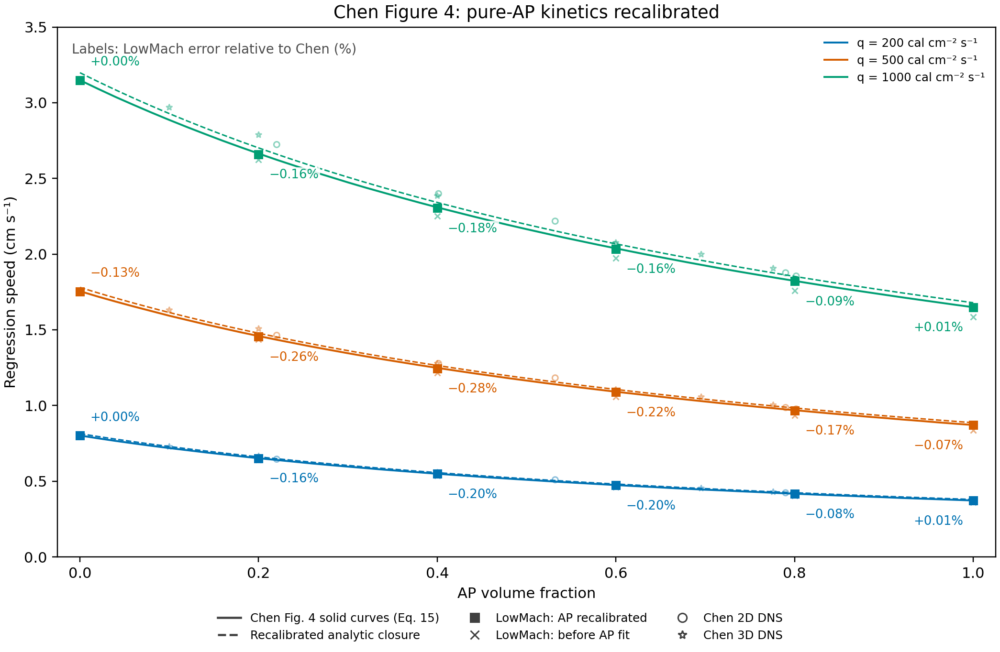

# Pure-AP Arrhenius calibration and Figure 4 sweep

The new pure-AP fit gives **A_AP=1179.58476 m/s**, **E_AP/R=10739.1532 K**, or **E_AP=89.290288 kJ/mol**. Previously A_AP=948 m/s and E_AP/R=11000 K. The physical law is `r=A*exp[-(E/R)/Ts]`; `run_study.py` converts A to the phase-field multiplier for each interface width.

Across all 18 points, mean absolute error versus Chen changes from **2.4105% to 0.1314%**. For the 12 unfitted interior mixtures alone it changes from **2.6570% to 0.1795%**. The held-out pure-AP q=500 case has error **-0.0657%**.

The single chart labels each new LowMach square with signed error `100*(r_LowMach/r_Chen-1)`. Solid curves are vector-extracted Chen Eq. 15 curves; dashed curves are our coupled analytic closure with the new AP parameters. Faint crosses are the previous volume-additive-density sweep. DNS circles/asterisks retain the paper's values. The reference curves and markers are unchanged.

| Flux/group | N | Previous mean absolute error [%] | New mean absolute error [%] | New maximum absolute error [%] |
|---|---|---|---|---|
| 200.0 | 6 | 2.3382 | 0.1063 | 0.1983 |
| 500.0 | 6 | 2.4681 | 0.1866 | 0.2790 |
| 1000.0 | 6 | 2.4252 | 0.1013 | 0.1821 |
| all | 18 | 2.4105 | 0.1314 | 0.2790 |
| mixtures_only | 12 | 2.6570 | 0.1795 | 0.2790 |

| q | AP fraction | Use | Chen [cm/s] | New LowMach [cm/s] | Previous error [%] | New error [%] |
|---|---|---|---|---|---|---|
| 200 | 0.0 | unchanged binder control | 0.801938 | 0.801944 | +0.0008 | +0.0008 |
| 200 | 0.2 | unfitted mixture prediction | 0.651967 | 0.650912 | -1.5002 | -0.1618 |
| 200 | 0.4 | unfitted mixture prediction | 0.549285 | 0.548196 | -2.4185 | -0.1983 |
| 200 | 0.6 | unfitted mixture prediction | 0.474660 | 0.473732 | -3.0412 | -0.1956 |
| 200 | 0.8 | unfitted mixture prediction | 0.417531 | 0.417214 | -3.3922 | -0.0759 |
| 200 | 1.0 | AP fit | 0.372801 | 0.372821 | -3.6762 | +0.0053 |
| 500 | 0.0 | unchanged binder control | 1.755380 | 1.753105 | -0.1296 | -0.1296 |
| 500 | 0.2 | unfitted mixture prediction | 1.458863 | 1.455121 | -1.6073 | -0.2565 |
| 500 | 0.4 | unfitted mixture prediction | 1.248483 | 1.244999 | -2.5367 | -0.2790 |
| 500 | 0.6 | unfitted mixture prediction | 1.090955 | 1.088609 | -3.1231 | -0.2150 |
| 500 | 0.8 | unfitted mixture prediction | 0.969225 | 0.967544 | -3.5692 | -0.1735 |
| 500 | 1.0 | AP held out | 0.871514 | 0.870941 | -3.8430 | -0.0657 |
| 1000 | 0.0 | unchanged binder control | 3.148773 | 3.148832 | +0.0019 | +0.0019 |
| 1000 | 0.2 | unfitted mixture prediction | 2.664215 | 2.659885 | -1.5288 | -0.1625 |
| 1000 | 0.4 | unfitted mixture prediction | 2.308875 | 2.304669 | -2.4778 | -0.1821 |
| 1000 | 0.6 | unfitted mixture prediction | 2.037804 | 2.034445 | -3.1296 | -0.1648 |
| 1000 | 0.8 | unfitted mixture prediction | 1.823276 | 1.821653 | -3.5598 | -0.0890 |
| 1000 | 1.0 | AP fit | 1.649370 | 1.649497 | -3.8535 | +0.0077 |

## Calibration and fixed assumptions

Only AP A and E/R were adjusted using the pure-AP endpoints at q=200 and 1000 cal/(cm² s). The q=500 pure-AP point and every interior mixture were excluded from the fit. Existing completed pure-AP runs supplied the initial measured solver/analytic ratios. For each target rate, the same established inversion computes `Ts=T0+[q/(rho*r)+Q]/cp`, then solves `ln(r)=ln(A)-(E/R)/Ts`; the solver-corrected target is the article rate divided by its previously measured solver/analytic ratio. Fresh endpoint runs independently verify the new fit. `freeze_record.json` records acceptance before the held-out case and mixture sweep were generated. The two fresh accepted fit runs are reused as the sweep's q=200/1000 pure-AP endpoints; all other 16 sweep points were run with the frozen file.

The direct analytic fit is A_AP=1135.33378 m/s and E_AP/R=10915.9238 K (`parameters_analytic.json`). The final solver-calibrated pair is conditional on the executed grid, interface and gas heating surrogate; it includes compensation for numerical bias.

The complete binder property dictionary and its calibration history are unchanged: rho=920 kg/m³, cp=2130 J/(kg K), k=0.213 W/(m K), Q=−66 cal/g, A=24.6083329584 m/s, E/R=5568.85064240 K. AP thermal properties remain rho=1950 kg/m³, cp=1297.9 J/(kg K), k=0.4186 W/(m K), Q=−100 cal/g. T0=300 K. Density is volume-additive; cp and Q remain mass-weighted; ln(A) and E/R remain volume-weighted; conductivity retains the existing Chen two-dimensional rule. Three fresh pure-binder controls reproduce the previous rates within relative tolerance 1e-9.

Gas chemistry is frozen. The prescribed gas-slab heating and negative phase-change Q are the configured thermal sources; there is no gas-reaction heat. Surface temperature is solved through the thermal/kinetic coupling. These are comparisons to the supplied article's model curves and DNS, not experimental material measurements. [Chen et al. (2002)](https://doi.org/10.1016/S1540-7489(02)80357-1).

## Runtime and numerical checks

Every sweep run reaches six thermal relaxation times, with ell/delta=0.25, eight cells per ell, 32 transverse cells and dt scale=0.2. Maximum late-window speed drift is 0.0311%. Changing the rate-fit window from the final 40% to the final 20%, 30% or 50% changes rates by at most 0.0189%. Rates come from raw eta=0.5 positions; independent volume-loss rates agree within 0.0009%.

At q=500 and 40% AP, a new twelve-relaxation-time run changes the measured rate from 1.24499945 to 1.24325460 cm/s (-0.1401%). Its late drift is -0.0884%. The deeper lower boundary preserves final cold-boundary separation, making this a combined duration/depth check; only this representative point was doubled. It does not replace a sweep point.

Solver/analytic rate differences span -1.7522% to -1.4925%; incident-flux errors span -0.9078% to -0.5261%. Fit scatter is not a statistical uncertainty estimate. This does not establish grid convergence. Figure stroke resolution is approximately 0.005 cm/s; extra reported digits preserve reproducibility.

## Reproduction and provenance

Cheaper `gpt-5.6-luna` agents launched the simulations and recorded observed terminal exits; the root/current model performed the calibration, raw-output extraction, audits, statistics and plotting. All accepted runs have matching input/executable hashes, successful receipts, finalized logs, full duration, fixed thermal/binder properties and independently recomputed closures. No solver source or executable changed for this follow-up.

`parameters_baseline.json` preserves the previous constituent values; `parameters_frozen.json`, `freeze_record.json`, `kinetics.csv`, `comparison.csv`, `error_summary.csv`, the execution audits, `fit_window_sensitivity.csv`, `duration_comparison.json` and `provenance.json` record this study. Earlier reports and figures remain intact. See `REPRODUCE.md` for commands.
