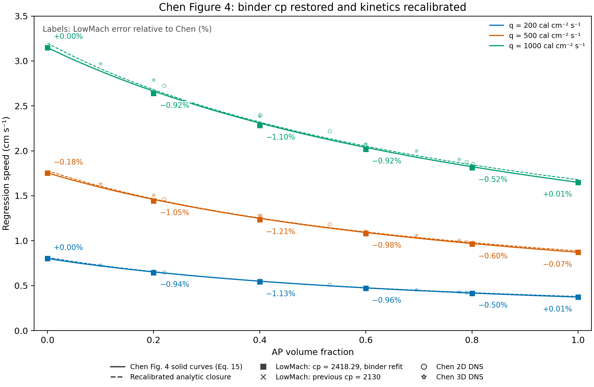

# Binder cp restoration, Arrhenius recalibration and Figure 4 sweep

Binder cp is restored from **2130 to 2418.29 J/(kg K)**. Binder Q remains **−66 cal/g = −276144 J/kg**. The new solver-calibrated binder pair is **A=36.274538 m/s**, **E/R=5443.691237 K**, or **E=45.26136729 kJ/mol = 10.81772641 kcal/mol**. Previously A=24.60833296 m/s and E/R=5568.850642 K. Only A and E/R are fitted; cp is a prescribed value.

Across 18 Figure 4 points, mean absolute error versus Chen changes from **0.1314% to 0.6164%**, and maximum absolute error from **0.2790% to 1.2143%**. The 12 unfitted interior mixtures change from **0.1795% to 0.9027%** mean absolute error. The held-out pure-binder q=500 point has error **-0.1773%**.

Each LowMach square is labeled with signed percent error `100*(r_LowMach/r_Chen−1)`. Solid curves are vector-extracted Chen Figure 4 Eq. 15 curves; dashed curves are the new analytic closure with mixed properties and a common coupled surface temperature. Faint crosses show the preceding accepted AP-calibrated sweep at binder cp=2130. Circles and asterisks retain Chen's 2D and 3D DNS points. Errors above refer to the solid curves; they are not statistical error bars.

| Flux/group | N | Previous mean absolute error [%] | New mean absolute error [%] | New maximum absolute error [%] |
|---|---|---|---|---|
| 200.0 | 6 | 0.1063 | 0.5902 | 1.1284 |
| 500.0 | 6 | 0.1866 | 0.6817 | 1.2143 |
| 1000.0 | 6 | 0.1013 | 0.5773 | 1.0965 |
| all | 18 | 0.1314 | 0.6164 | 1.2143 |
| mixtures_only | 12 | 0.1795 | 0.9027 | 1.2143 |

| q | AP fraction | Use | Chen [cm/s] | New LowMach [cm/s] | Previous error [%] | New error [%] |
|---|---|---|---|---|---|---|
| 200 | 0.0 | binder fit | 0.801938 | 0.801970 | +0.0008 | +0.0040 |
| 200 | 0.2 | unfitted mixture prediction | 0.651967 | 0.645829 | -0.1618 | -0.9415 |
| 200 | 0.4 | unfitted mixture prediction | 0.549285 | 0.543087 | -0.1983 | -1.1284 |
| 200 | 0.6 | unfitted mixture prediction | 0.474660 | 0.470110 | -0.1956 | -0.9586 |
| 200 | 0.8 | unfitted mixture prediction | 0.417531 | 0.415429 | -0.0759 | -0.5034 |
| 200 | 1.0 | unchanged AP control | 0.372801 | 0.372821 | +0.0053 | +0.0053 |
| 500 | 0.0 | binder held out | 1.755380 | 1.752268 | -0.1296 | -0.1773 |
| 500 | 0.2 | unfitted mixture prediction | 1.458863 | 1.443570 | -0.2565 | -1.0483 |
| 500 | 0.4 | unfitted mixture prediction | 1.248483 | 1.233322 | -0.2790 | -1.2143 |
| 500 | 0.6 | unfitted mixture prediction | 1.090955 | 1.080253 | -0.2150 | -0.9810 |
| 500 | 0.8 | unfitted mixture prediction | 0.969225 | 0.963373 | -0.1735 | -0.6038 |
| 500 | 1.0 | unchanged AP control | 0.871514 | 0.870941 | -0.0657 | -0.0657 |
| 1000 | 0.0 | binder fit | 3.148773 | 3.148856 | +0.0019 | +0.0026 |
| 1000 | 0.2 | unfitted mixture prediction | 2.664215 | 2.639781 | -0.1625 | -0.9171 |
| 1000 | 0.4 | unfitted mixture prediction | 2.308875 | 2.283558 | -0.1821 | -1.0965 |
| 1000 | 0.6 | unfitted mixture prediction | 2.037804 | 2.018995 | -0.1648 | -0.9230 |
| 1000 | 0.8 | unfitted mixture prediction | 1.823276 | 1.813853 | -0.0890 | -0.5168 |
| 1000 | 1.0 | unchanged AP control | 1.649370 | 1.649497 | +0.0077 | +0.0077 |

## Parameters and calibration

| Parameter set | A [m/s] | E/R [K] | E [kJ/mol] | E [kcal/mol] |
|---|---|---|---|---|
| original binder | 10.36 | 7500 | 62.35846964 | 14.90403194 |
| previous accepted binder | 24.608333 | 5568.85064 | 46.30200049 | 11.06644371 |
| cp restored: analytic binder fit | 33.992294 | 5469.10103 | 45.47263604 | 10.86822085 |
| cp restored: solver-calibrated binder | 36.274538 | 5443.69124 | 45.26136729 | 10.81772641 |
| original AP | 948 | 11000 | 91.45908880 | 21.85924685 |
| current AP (unchanged) | 1179.58476 | 10739.1532 | 89.29028801 | 21.34089102 |

The physical rate law is `r=A exp[−(E/R)/Ts]`. A is a speed prefactor; the input generator converts it to the phase-field multiplier appropriate to each interface width. `activation_temperature_K` stores E/R, not E. Conversions use R=8.31446261815324 J/(mol K) and 1 kcal=4.184 kJ. `parameter_comparison.csv` includes all constituent properties, including unchanged values and the original engineering baseline.

Binder density remains 920 kg/m³ and conductivity remains 0.213 W/(m K). All AP properties and its prior calibration history are unchanged: density=1950 kg/m³, cp=1297.9 J/(kg K), conductivity=0.4186 W/(m K), Q=−100 cal/g, A=1179.584762 m/s, E/R=10739.15322 K, E=89.29028801 kJ/mol=21.34089102 kcal/mol. T0 remains 300 K. Three fresh pure-AP controls reproduce the previous rates within relative tolerance 1e−9.

The established two-endpoint calibration uses pure binder at q=200 and 1000 cal/(cm² s). For each target rate, the fixed balance gives `Ts=T0+[q/(rho*r)+Q]/cp`; then a two-point solve gives ln(A) and E/R. The initial analytic pair is A=33.99229401 m/s and E/R=5469.101027 K. After running those two cases, each target is divided by its measured solver/analytic rate ratio and the Arrhenius inversion is repeated. Fresh endpoint runs verify that corrected pair. `freeze_record.json` records acceptance before the q=500 holdout and mixture runs were generated. The two accepted calibration cases supply two of the 18 sweep points; the other 16 are new frozen-parameter runs.

The q=500 binder point and all mixtures are excluded from fitting. The prior AP calibration is retained. These effective kinetics are conditional on the thermal properties, discretization and heating surrogate; they are not independently measured material constants. The abandoned cp-and-Q restoration is excluded from this study. This cp-only study has surface temperatures ranging from 650.757 to 966.341 K across the 18 simulations, all above T0.

Matching the pure endpoints does not fix the interior mixture response. The cp change alters the relation between heat input, surface temperature and rate. After refitting A and E, volume mixing of ln(A) and E/R with a single coupled surface temperature need not reproduce Chen's Eq. 15 harmonic interpolation of pure-component rates at their respective surface temperatures. The mixture errors therefore assess this combined mixing closure as well as the remaining numerical bias.

Density is volume-additive. Specific heat and Q, both specified per unit mass, are mass-weighted using mass fractions derived from the pure constituent densities. This conserves `rho*cp` and `rho*Q` under volume mixing. ln(A) and E/R retain volume weighting; conductivity retains the existing Chen two-dimensional rule. Gas chemistry is frozen, so there is no gas-reaction heat. The prescribed gas-slab heat input and endothermic phase-change Q remain the thermal sources. Surface temperature is solved through thermal/kinetic coupling.

## Runtime and numerical checks

Every standard sweep case reaches six thermal relaxation times, with ell/delta=0.25, eight cells per ell, 32 transverse cells and dt scale=0.2. Pressure=100 MPa, gas conductivity=100 W/(m K), gas cp=1000 J/(kg K), and temperature advection is disabled, as in the preceding accepted sweep. Rates are slopes fitted to raw eta=0.5 front positions over the final 40% of each run. Maximum late speed drift is 0.03108%. Using the final 20%, 30% or 50% instead changes rates by at most 0.01894%. Independent volume-loss rates agree within 0.00086%.

At q=500 and 40% AP, a twelve-relaxation-time repeat changes the measured speed from 1.233322039 to 1.231665111 cm/s, or **-0.13435%**, with late drift -0.08524%. The simulated durations are 0.00452543924 and 0.00905044225 s. The deeper lower boundary preserves final cold-boundary separation, so this checks duration and domain depth together at one representative point. It does not replace a standard sweep point.

Solver/analytic rate differences span -1.7522% to -1.4733%; incident-flux errors span -0.9078% to -0.4957%. Rate-fit scatter is not a statistical uncertainty estimate. The duration and window checks assess steadiness, not mesh convergence or physical-model accuracy. Chen's curve stroke resolution is approximately 0.005 cm/s; extra digits preserve reproducibility. The source consists of model curves and DNS, not experimental measurements: [Chen et al. (2002)](https://doi.org/10.1016/S1540-7489(02)80357-1).

## Reproduction and provenance

Cheaper `gpt-5.6-luna` agents launched the simulations and recorded actual terminal exits. The root/current model performed calibration, raw-output extraction, audits, statistics and plotting. All accepted cases have matching input/executable hashes, successful receipts, finalized solver logs, full requested durations, matching frozen parameters and independently recomputed closures. No production solver code or executable changed for this follow-up.

`parameters_baseline.json` preserves the prior accepted parameter file byte for byte. `fixed_properties.json` fixes the new binder cp and all retained properties. `parameters_frozen.json`, `freeze_record.json`, `parameter_comparison.csv`, `comparison.csv`, `error_summary.csv`, execution audits, `fit_window_sensitivity.csv`, `duration_comparison.json` and `provenance.json` retain the results and checks. Earlier reports and figures remain intact. See [REPRODUCE.md](REPRODUCE.md) for commands.
