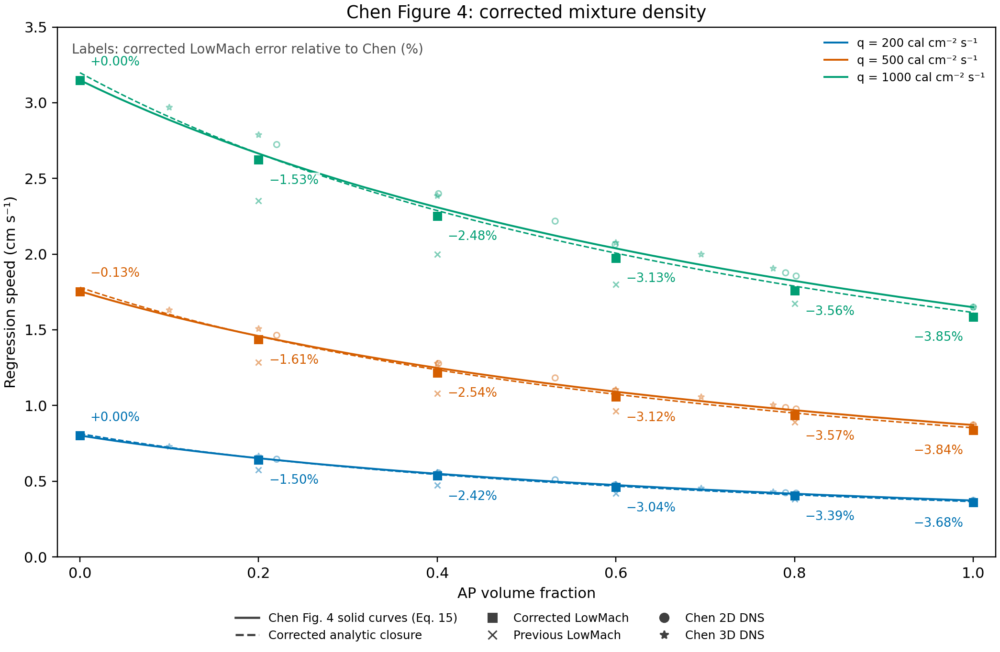

# Figure 4 sweep with volume-additive mixture density

The density correction reduces the 18-case mean absolute error against Chen Figure 4 from **8.157% to 2.411%**. At 40% AP and q=500 cal/(cm² s), the measured LowMach error changes from **-13.521% to -2.537%**. The corrected analytic prediction at that point has error **-1.004%**. The earlier approximately −1% claim referred to that analytic result; the actual corrected solver result is reported separately here.

The largest corrected absolute error is 3.854% at q=1000, AP volume fraction 1. Parameters were frozen throughout; no A/E, cp, Q, conductivity or AP endpoint was refitted. All six pure-endpoint reruns reproduce their previous rates within relative tolerance 1e-9.

The single regression-speed chart labels every corrected LowMach square with its signed percentage error relative to Chen's solid curve, `100*(r_LowMach/r_Chen-1)`. The dashed curves show the corrected analytic closure. Previous LowMach results remain faint crosses.

| q | Previous mean absolute error [%] | Corrected mean absolute error [%] | Corrected maximum error [%] |
|---|---|---|---|
| 200 | 8.126 | 2.338 | 3.676 |
| 500 | 8.209 | 2.468 | 3.843 |
| 1000 | 8.134 | 2.425 | 3.854 |
| all | 8.157 | 2.411 | 3.854 |

| q | AP volume fraction | Chen [cm/s] | Previous [cm/s] | Corrected [cm/s] | Previous error [%] | Corrected error [%] |
|---|---|---|---|---|---|---|
| 200 | 0.0 | 0.80194 | 0.80194 | 0.80194 | +0.001 | +0.001 |
| 200 | 0.2 | 0.65197 | 0.57487 | 0.64219 | -11.825 | -1.500 |
| 200 | 0.4 | 0.54928 | 0.47517 | 0.53600 | -13.494 | -2.418 |
| 200 | 0.6 | 0.47466 | 0.41931 | 0.46022 | -11.661 | -3.041 |
| 200 | 0.8 | 0.41753 | 0.38371 | 0.40337 | -8.100 | -3.392 |
| 200 | 1.0 | 0.37280 | 0.35910 | 0.35910 | -3.676 | -3.676 |
| 500 | 0.0 | 1.75538 | 1.75311 | 1.75311 | -0.130 | -0.130 |
| 500 | 0.2 | 1.45886 | 1.28616 | 1.43541 | -11.839 | -1.607 |
| 500 | 0.4 | 1.24848 | 1.07968 | 1.21681 | -13.521 | -2.537 |
| 500 | 0.6 | 1.09095 | 0.96351 | 1.05688 | -11.682 | -3.123 |
| 500 | 0.8 | 0.96922 | 0.88935 | 0.93463 | -8.242 | -3.569 |
| 500 | 1.0 | 0.87151 | 0.83802 | 0.83802 | -3.843 | -3.843 |
| 1000 | 0.0 | 3.14877 | 3.14883 | 3.14883 | +0.002 | +0.002 |
| 1000 | 0.2 | 2.66421 | 2.35267 | 2.62348 | -11.694 | -1.529 |
| 1000 | 0.4 | 2.30887 | 1.99945 | 2.25167 | -13.402 | -2.478 |
| 1000 | 0.6 | 2.03780 | 1.80054 | 1.97403 | -11.643 | -3.130 |
| 1000 | 0.8 | 1.82328 | 1.67355 | 1.75837 | -8.212 | -3.560 |
| 1000 | 1.0 | 1.64937 | 1.58581 | 1.58581 | -3.854 | -3.854 |

## Change and fixed assumptions

`PhaseChange.H` now uses `rho=(1-t)*rho_binder+t*rho_AP`, equivalently `1/rho=(1-w)/rho_binder+w/rho_AP`. Specific heat and Q remain mass-weighted. Consequently rho*cp and rho*Q equal the sums of constituent heat capacities and phase-change energies per initial volume. The study generator uses this density consistently for its coupled reference solution, initial solid density, interface scaling and thermal relaxation time. Tests verify additive volume, heat capacity, phase-change heat, product mass conservation and thermal coupling.

Binder rho=920 kg/m³, cp=2130 J/(kg K), k=0.213 W/(m K), Q=−66 cal/g, A=24.60833296 m/s and E/R=5568.850642 K remain fixed. AP retains rho=1950 kg/m³, cp=1297.90 J/(kg K), k=0.4186 W/(m K), Q=−100 cal/g, A=948 m/s and E/R=11000 K. T0=300 K. E/R and ln(A) are volume-weighted; conductivity retains the existing Chen two-dimensional rule. Q is parsed as energy per mass and multiplied by transferred mass.

Gas chemistry remains frozen and the only phase-change mechanism is binder regression. The gas-slab source supplies the prescribed heat flux; negative Q absorbs heat. Surface temperature is computed from the coupled energy/kinetic problem, rather than prescribed independently. The article comparator is the vector-extracted solid curve (Eq. 15), interpolated at each selected volume fraction. DNS markers are overlaid but are not treated as independent experimental observations. [Chen et al. (2002)](https://doi.org/10.1016/S1540-7489(02)80357-1).

## Runtime and numerical checks

All 18 sweep points were rerun with the corrected executable, including pure endpoints. The six-relaxation-time setup retains ell/delta=0.25, eight cells per ell, 32 transverse cells and dt scale=0.2. Maximum late-window rate drift is 0.0269%. Changing the fitting window to the final 20%, 30%, 40% or 50% changes baseline rates by at most 0.0165%. Rates are deterministic eta=0.5 position slopes, cross-checked against integrated solid-volume loss; maximum disagreement is 0.0009%.

At 40% AP and q=500, a separate twelve-relaxation-time run changes the rate from 1.21681298 to 1.21515375 cm/s (-0.1364%). The deeper lower boundary maintains the final cold-boundary separation, so this is a combined duration/deep-boundary check. Its late-window drift is -0.0870%. Only this representative point has doubled-duration verification. The longer result does not replace a sweep point.

Corrected solver/analytic errors span -1.760% to -1.493%; incident-flux errors span -0.892% to -0.526%. Matching the analytic density rule does not remove the gas heating/interface surrogate's numerical bias or the unfitted AP endpoint error. This is not a grid-convergence or experimental validation study. Figure stroke resolution remains about 0.005 cm/s.

## Execution provenance

Three `gpt-5.6-luna` agents launched the simulations, each owning one flux group. The q=500 agent also launched the duration check. The root/current model performed all raw-output extraction, audits, fit-window analysis, error calculations and plotting. A premature completion receipt for the duration check was removed while that run continued; incomplete data were excluded. Final acceptance requires a successful observed exit, matching input/executable hashes, a finalized solver log and completed requested duration. The corrected executable SHA-256 is `2ecdfd604ccd6f2e25adc66d282145f144ffbd91fbdef3fb1eebe8c111025417`. Fixed parameter SHA-256 is `e5cb3b223cb5506388fd4ad80ba76bbe8be31ba968c34ecb1f0e6b675aa247f7`.

The old executable and changed source/input files are retained under `baseline_snapshot/`; old sweep outputs and reports are preserved. `density_change.patch` isolates this correction from earlier workspace changes. Build and solver/unit-test logs are retained under `checks/`. `comparison.csv`, `error_summary.csv`, `mixed_properties.csv`, `fit_window_sensitivity.csv`, `duration_comparison.json`, execution audits and `provenance.json` hold the machine-readable evidence. See `REPRODUCE.md` for commands.
