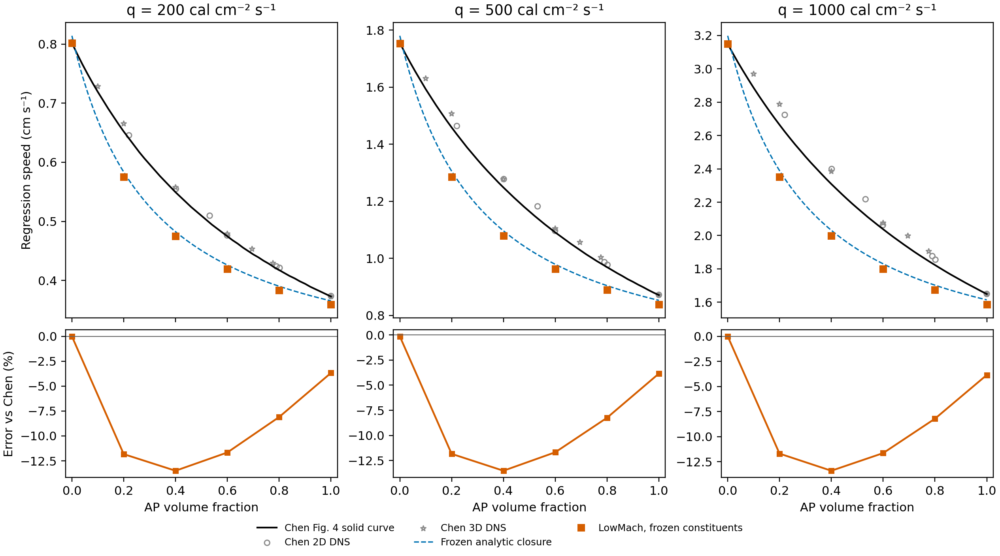

# Frozen-constituent sweep compared with Chen Figure 4

All 18 cases completed: AP volume fractions 0, 0.2, 0.4, 0.6, 0.8 and 1 at q=200, 500 and 1000 cal/(cm² s). The three pure-binder cases are reused from the calibration/held-out assessment; the remaining 15 cases are new predictions with frozen constituent properties. No mixture data were used to change any parameter.

Across all 18 cases, mean absolute relative error against Chen's Figure 4 solid curves is **8.157%**; the largest absolute error is **13.521%**, at q=500, AP volume fraction 0.4, where LowMach gives 1.07968 cm/s versus Chen 1.24848 cm/s. Signed error is `100*(r_LowMach/r_Chen - 1)`; negative values mean underprediction.

`figure4_overlay.pdf` / `.png` reproduce the original single-axis arrangement
of all three flux curves, with the new simulation points overlaid.

## Pointwise errors

| q [cal/(cm² s)] | AP volume fraction | LowMach [cm/s] | Chen [cm/s] | Error [%] |
|---|---|---|---|---|
| 200 | 0.0 | 0.80194 | 0.80194 | +0.001 |
| 200 | 0.2 | 0.57487 | 0.65197 | -11.825 |
| 200 | 0.4 | 0.47517 | 0.54928 | -13.494 |
| 200 | 0.6 | 0.41931 | 0.47466 | -11.661 |
| 200 | 0.8 | 0.38371 | 0.41753 | -8.100 |
| 200 | 1.0 | 0.35910 | 0.37280 | -3.676 |
| 500 | 0.0 | 1.75311 | 1.75538 | -0.130 |
| 500 | 0.2 | 1.28616 | 1.45886 | -11.839 |
| 500 | 0.4 | 1.07968 | 1.24848 | -13.521 |
| 500 | 0.6 | 0.96351 | 1.09095 | -11.682 |
| 500 | 0.8 | 0.88935 | 0.96922 | -8.242 |
| 500 | 1.0 | 0.83802 | 0.87151 | -3.843 |
| 1000 | 0.0 | 3.14883 | 3.14877 | +0.002 |
| 1000 | 0.2 | 2.35267 | 2.66421 | -11.694 |
| 1000 | 0.4 | 1.99945 | 2.30887 | -13.402 |
| 1000 | 0.6 | 1.80054 | 2.03780 | -11.643 |
| 1000 | 0.8 | 1.67355 | 1.82328 | -8.212 |
| 1000 | 1.0 | 1.58581 | 1.64937 | -3.854 |

| q | Mean signed error [%] | Mean absolute error [%] | RMS relative error [%] | Max absolute error [%] |
|---|---|---|---|---|
| 200 | -8.126 | 8.126 | 9.461 | 13.494 |
| 500 | -8.209 | 8.209 | 9.506 | 13.521 |
| 1000 | -8.134 | 8.134 | 9.436 | 13.402 |
| all | -8.156 | 8.157 | 9.467 | 13.521 |

The comparator is linear interpolation of the vector-extracted **solid curves** in Figure 4 (equation 15), including exact pure-material endpoints. It is not an error calculation against individual scattered DNS markers. Both 2D and 3D DNS markers from the paper are shown in the overlay. These are published model/DNS results, not experimental burn-rate data. One printed stroke is approximately 0.005 cm/s; the displayed numerical precision does not imply equivalent source accuracy. See [Chen et al. (2002)](https://doi.org/10.1016/S1540-7489(02)80357-1).

## Frozen properties and mixing

Binder: rho=920 kg/m³, cp=2130 J/(kg K), k=0.213 W/(m K), Q=−276144 J/kg (−66 cal/g), A=24.608333 m/s, E/R=5568.8506 K. AP retains `reference/pure_htpb.json`: rho=1950 kg/m³, cp=1297.90 J/(kg K), k=0.4186 W/(m K), Q=−418400 J/kg, A=948 m/s, E/R=11000 K. T0=300 K.

The existing homogeneous implementation converts AP volume fraction t to mass fraction `w=rho_AP*t/[rho_AP*t+rho_binder*(1-t)]`, then uses mass-weighted density, cp and Q. Activation temperature is volume-weighted and ln(A) is volume-weighted. Conductivity follows the existing two-dimensional Chen mixing formula. Pure constituent values are supplied once. The density mixing convention is inherited from the existing study and implementation; no mixing rule is refitted here. The arithmetic mass-weighted density differs from ordinary volume-additive mixture density, so these errors characterize this implemented closure.

The blue dashed curves are independent analytic evaluations of equations (14)/(19) using the frozen mixed properties. Their separation from the black Chen curves measures closure/constituent differences. The additional difference between the LowMach squares and blue curves measures the numerical heating/interface surrogate. `comparison.csv` records both errors separately. Matching pure binder does not force agreement for mixtures or the unfitted pure AP endpoint.

## Numerical checks and reproducibility

All cases use the inherited settings: ell/delta=0.25, eight cells per ell, 32 transverse cells, dt scale=0.2, six relaxation times, gas k=100 W/(m K), gas cp=1000 J/(kg K), pressure 100 MPa, prescribed gas-slab heating, frozen chemistry, and disabled temperature advection. Rates are measured from raw eta=0.5 interface-position fits over the final 40% of each simulation, cross-checked against volume loss.

Maximum late-window speed drift is 0.0269%; the 0.2% steadiness criterion is met for all cases. Maximum disagreement between volume-loss and interface-position rates is 0.0009%. Incident-flux errors span -0.892% to -0.526%. Solver/analytic rate errors span -1.760% to -1.482%. These checks do not establish grid convergence or validate an experimental pressure-dependent gas flame.

`execution_audit.json` verifies completed durations, successful solver exits, input/binary hashes, unchanged constituent parameters and independently recomputed analytic targets for every case. The frozen parameter file is `../parameters_frozen.json`, SHA-256 `e5cb3b223cb5506388fd4ad80ba76bbe8be31ba968c34ecb1f0e6b675aa247f7`. `comparison.csv` contains pointwise results; `error_summary.csv` contains error aggregates; `mixed_properties.csv` lists the thermal and Arrhenius properties at each composition; `figure4_comparison.pdf` is the exportable overlay.

See `../REPRODUCE.md` for the calibration and sweep commands.
